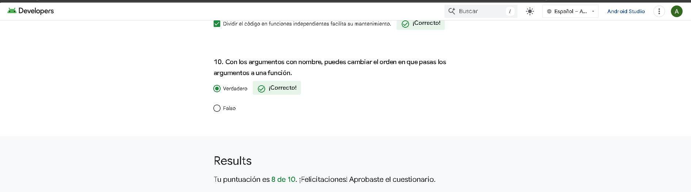

# Introducción a Kotlin 🚀

¡Bienvenido/a a mi primer proyecto en Kotlin! Este es el resultado de mi primer Codelab como parte de mi curso de introducción a Kotlin. Aquí, exploro los conceptos básicos del lenguaje y empiezo a familiarizarme con sus principales características, como variables, funciones y estructuras de control.

---

## 📝 Descripción del proyecto

En este ejercicio simple, he creado un programa que:

1. **Imprime un saludo**: Muestra el mensaje `"Hello, world!"` en la consola.
2. **Manipula un contador**: Declara una variable `count` que representa la cantidad de mensajes no leídos y la incrementa y decrementa.
3. **Muestra un mensaje personalizado**: Usa una función `showMessage` para devolver un mensaje y una función `readMessage` para leer e imprimir el mensaje junto con el número de mensajes no leídos.

El propósito de este ejercicio es entender cómo trabajar con variables, funciones, tipos de datos y la sintaxis básica de Kotlin.

---

## 🧑‍💻 Mi primer Codelab en Kotlin

Aquí está el código que he desarrollado como parte de mi primer Codelab:

```kotlin
fun main() {

    println("Hello, world!")

    var count: Int = 0
    println("You have unread $count messages")

    count++ // Aumenta el contador en 1.
    println("You have unread $count messages")

    count-- // Disminuye el contador en 1.
    readMessage(showMessage(), count)

}

fun showMessage(): String {
    val message: String = "Hello developer!"
    return message
}

fun readMessage(message: String, countMessage: Int) {
    println(message)
    println("You have unread $countMessage messages")
}
```

---

## Resultados del Cuestionario

<p align="center">

</p>
